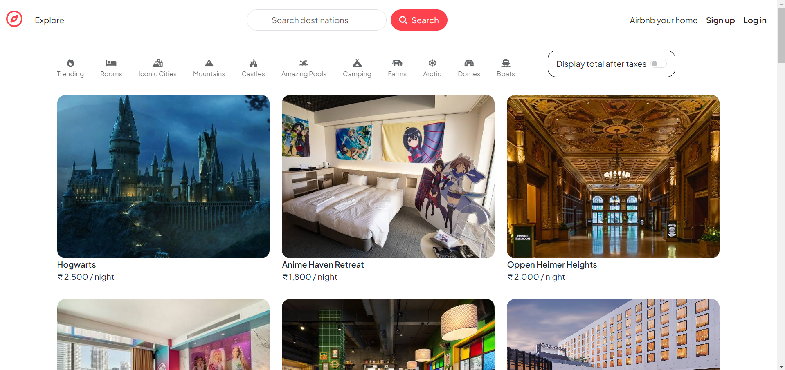
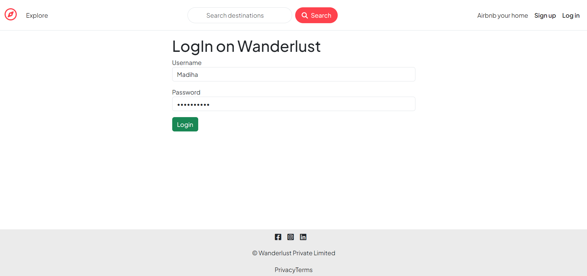
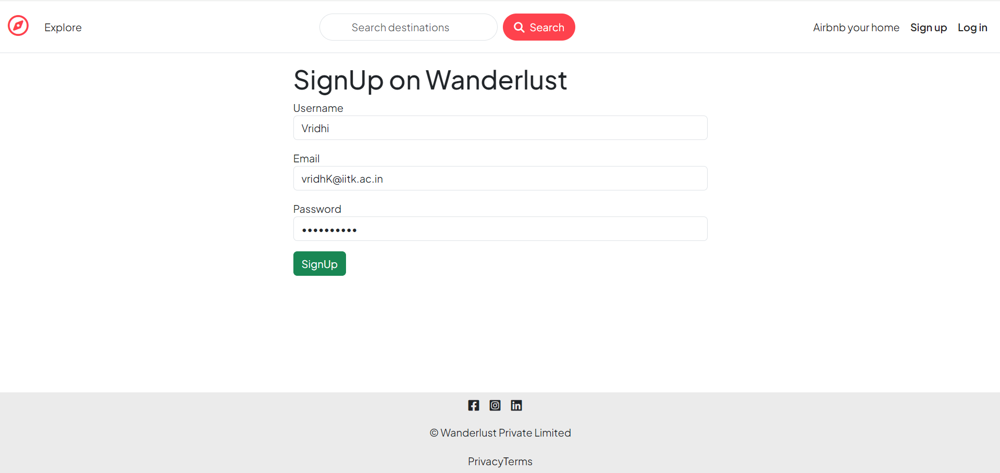
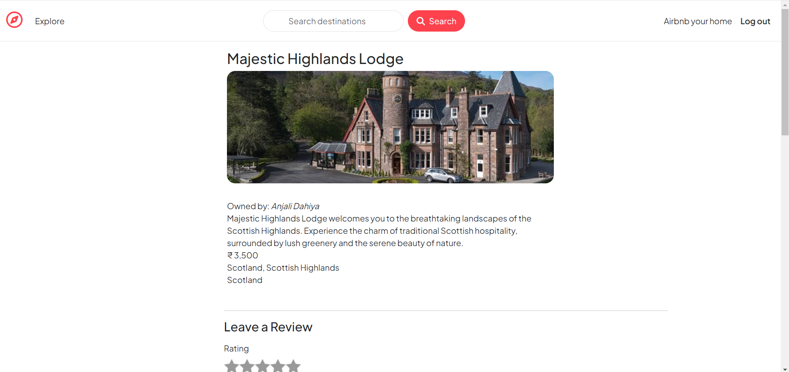
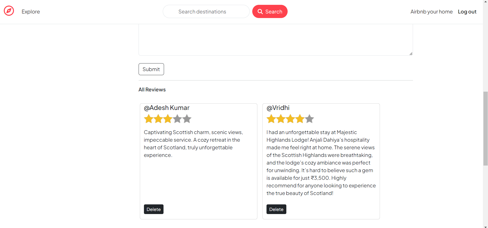
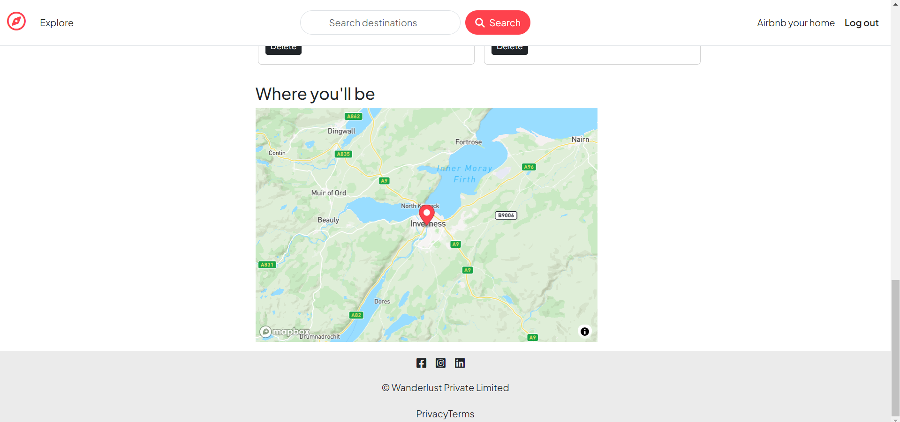
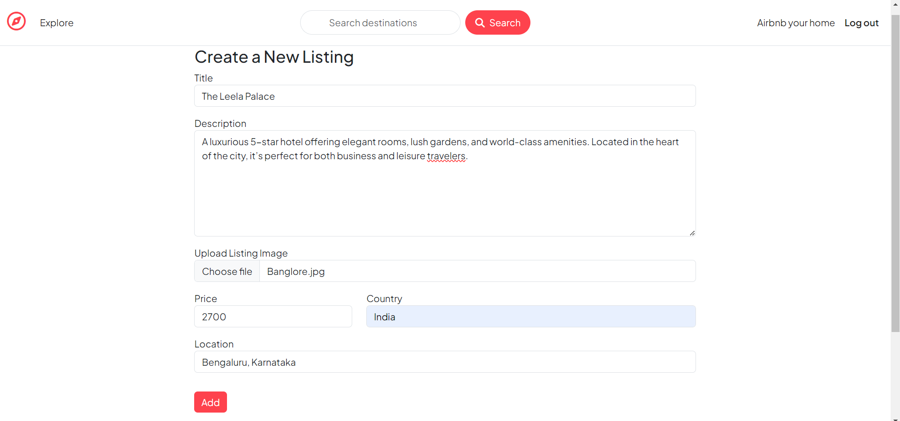
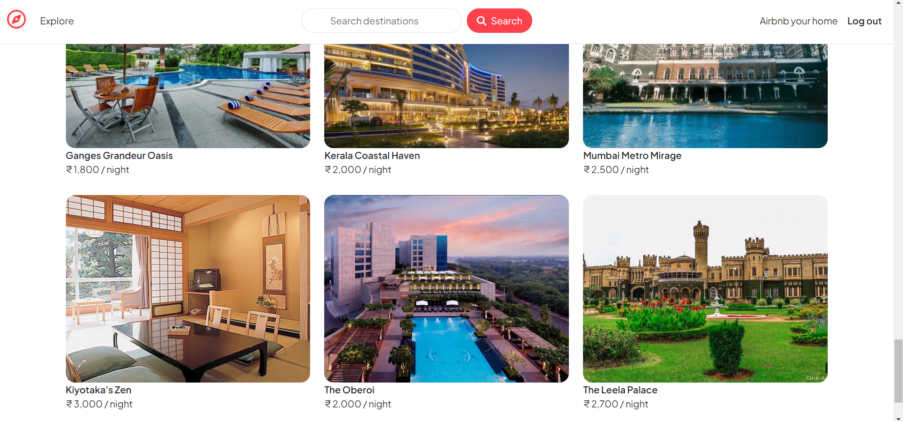
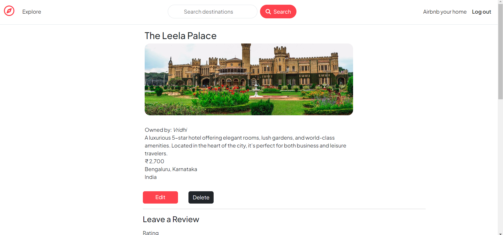
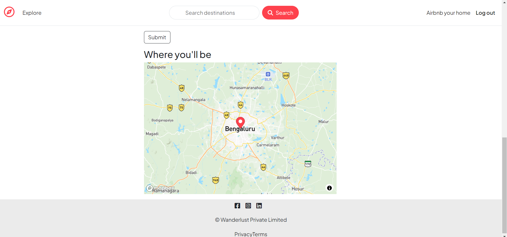

# WanderLust

**WanderLust** is a dynamic Full Stack project for global hotel exploration, reviews, and user-contributed listings. It enables users to browse hotels, view ratings, contribute reviews, and explore locations with map integration.

## Tech Stack

- **Client**: EJS, CSS
- **Server**: Node JS, Express JS
- **Database**: MongoDB
- **Frontend Architecture**: Context API

## Demo

[WanderLust](https://wanderlust-a1zn.onrender.com/listings)



## Run Locally

Clone the project

```bash
git clone https://github.com/ToushifAlam/wander-lust
```

Go to project directory

```bash
cd wander-lust
```

Install dependencies

```bash
npm install
```

Start the server

```bash
node app.js
```


## Features

### 1. Authentication





### 2. Individual Hotel Profile



### 3. Review



### 4. Location on Map



### 5. Add Hotels










## Made By
[@Toushif](https://github.com/ToushifAlam)
